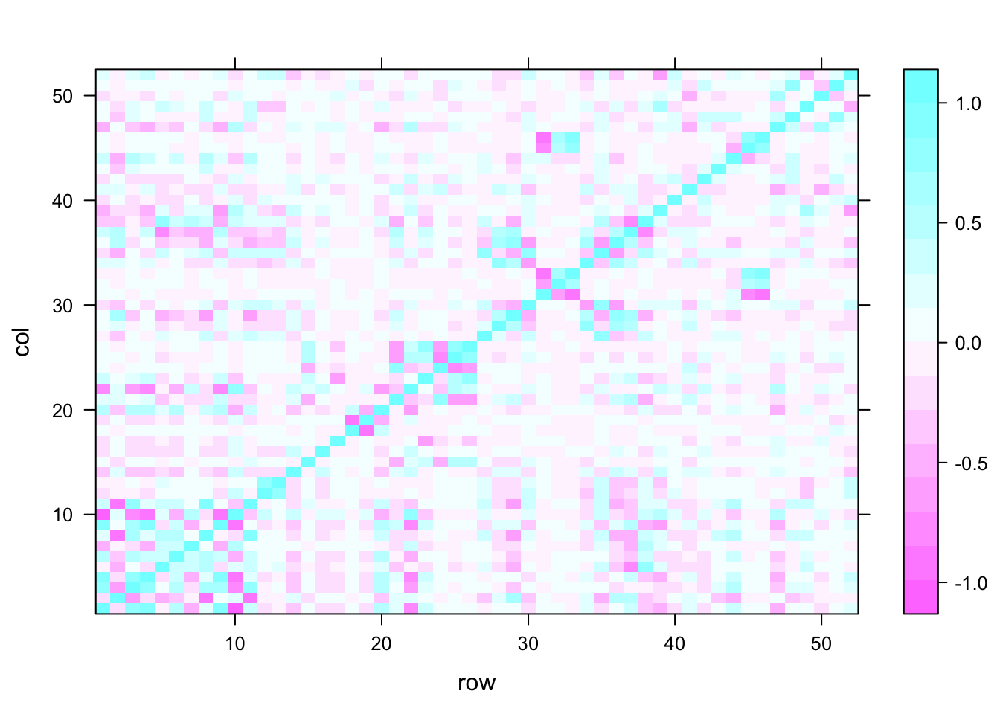
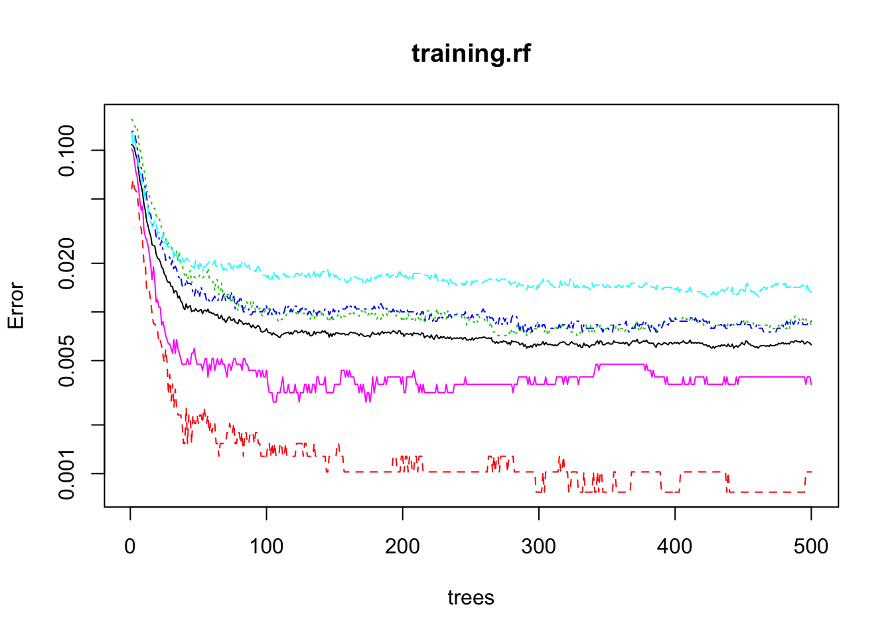
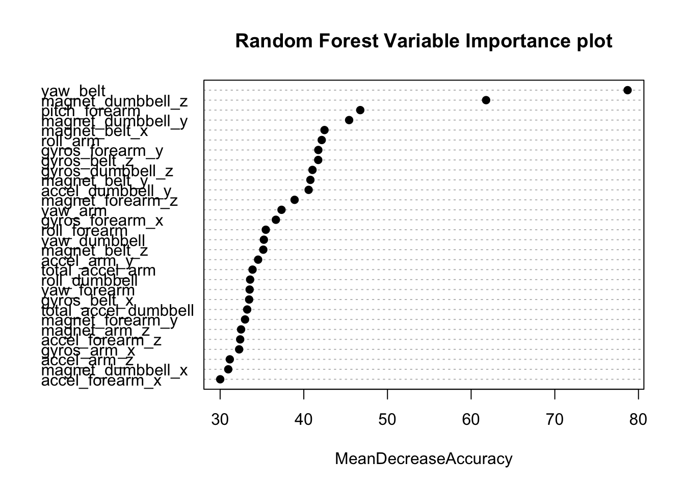

# PredictiveML
Del  
15 de Dezembro de 2014  

### Background

Using devices such as **Jawbone Up**, **Nike FuelBand**, and **Fitbit** it is now possible to collect a large amount of data about personal activity relatively inexpensively. These type of devices are part of the quantified self movement – a group of enthusiasts who take measurements about themselves regularly to improve their health, to find patterns in their behavior, or because they are tech geeks. One thing that people regularly do is quantify **how much** of a particular activity they do, but they rarely quantify **how well** they do it. In this project, your goal will be to use data from accelerometers on the belt, forearm, arm, and dumbell of 6 participants. They were asked to perform barbell lifts correctly and incorrectly in 5 different ways. More information is available from the website here: <http://groupware.les.inf.puc-rio.br/har>.

Our outcome variable is **classe**, a 5 levels factor variable. Participants were asked to perform one set of 10 repetitions of the *unilateral dumbbell biceps curl* in the following 5 different ways:

* Class A: exactly according to the specification
* Class B: throwing the elbows to the front
* Class C: lifting the dumbbell only halfway
* Class D: lowering the dumbbell only halfway
* Class E: throwing the hips to the front

Class B, C, D, and E being common mistakes doing this exercise, while Class A is the only correct way to perform *unilateral dumbell biceps curl*.

### Reproduceability

Loading the correct packages and data.


```r
library(caret)
```

```
## Warning: package 'caret' was built under R version 3.1.2
```

```
## Loading required package: lattice
## Loading required package: ggplot2
```

```r
library(randomForest)
```

```
## randomForest 4.6-10
## Type rfNews() to see new features/changes/bug fixes.
```

```r
if (! file.exists('./pml-training.csv')) {download.file('http://d396qusza40orc.cloudfront.net/predmachlearn/pml-training.csv', destfile = './pml-training.csv')}
if (! file.exists('./pml-testing.csv')) {download.file('http://d396qusza40orc.cloudfront.net/predmachlearn/pml-testing.csv', destfile = './pml-testing.csv')}

train.RAW <- read.csv("./pml-training.csv", na.strings = c("", "NA", "NULL"))
test.RAW <- read.csv("./pml-testing.csv", na.strings = c("", "NA", "NULL"))
```

## Cleaning Data


```r
train.RAW <- train.RAW[ , colSums(is.na(train.RAW)) == 0]
rmvNA <- apply(train.RAW, 2, function(x) {sum(is.na(x))})
train <- train.RAW[, which(rmvNA == 0)]
test <- test.RAW[, which(rmvNA == 0)]

rm.class <- grep("timestamp|X|user_name|new_window|num_window", names(train))
train <- train[ , -c(rm.class, length(train))]
test <- test[ , -c(rm.class, length(test))]
```

Check for high correlation


```r
library(caret)
corrMat <- cor(na.omit(train[sapply(train, is.numeric)]))
corrDF <- expand.grid(row = 1:52, col = 1:52)
corrDF$corr <- as.vector(corrMat)
levelplot(corr ~ row + col, corrDF)
```

 

Remove high correlation


```r
highCorr <- findCorrelation(corrMat, cutoff = .8, verbose = FALSE)
train <- cbind(classe = train.RAW$classe, train[ , -highCorr])
test <- test[ , -highCorr]
```


## Spliting for Cross Validation

We proceed to subset the data using the output from the crateDataPartitation function. We subset it into the *training* and *testing* datasets. In this function *p* specifies the proportion of data that will exist in each chunk after splitting the data, in this case we split into two chunks of 70% and 30%.


```r
inTrain <- createDataPartition(train$classe, p = 0.7, list = F)
training <- train[inTrain, ]
testing <- train[-inTrain, ]
```


## Cross Validation Testing and Out-of-Sample Error Estimate

Cross-validation can be performed, since we just subsampled our training data set randomly without replacement into 2 subsamples: **training** (70% of the original train data set) and **testing** (30%). Our model will be fitted on the training data set, and tested on the testing data. Let's apply a famous algorithm for it's high accuracy, Random Forest.


```r
set.seed(1234)
training.rf <- randomForest(classe ~ ., data = training, ntree = 500, importance = TRUE)
training.rf
```

```
## 
## Call:
##  randomForest(formula = classe ~ ., data = training, ntree = 500,      importance = TRUE) 
##                Type of random forest: classification
##                      Number of trees: 500
## No. of variables tried at each split: 6
## 
##         OOB estimate of  error rate: 0.63%
## Confusion matrix:
##      A    B    C    D    E class.error
## A 3902    2    1    0    1 0.001024066
## B   13 2636    9    0    0 0.008276900
## C    0   18 2375    3    0 0.008764608
## D    0    0   28 2222    2 0.013321492
## E    0    0    3    6 2516 0.003564356
```

```r
plot(training.rf, log = "y")
```

 

```r
varImpPlot(training.rf, type = 1, pch = 19, col = 1, cex = 1, main = "Random Forest Variable Importance plot")
```

 


```r
library(randomForest)
pred.rf <- predict(training.rf, testing, type = "class")
confusionMatrix(pred.rf, testing$classe)
```

```
## Confusion Matrix and Statistics
## 
##           Reference
## Prediction    A    B    C    D    E
##          A 1674    8    0    0    0
##          B    0 1126    7    0    0
##          C    0    5 1018   16    1
##          D    0    0    1  947    2
##          E    0    0    0    1 1079
## 
## Overall Statistics
##                                          
##                Accuracy : 0.993          
##                  95% CI : (0.9906, 0.995)
##     No Information Rate : 0.2845         
##     P-Value [Acc > NIR] : < 2.2e-16      
##                                          
##                   Kappa : 0.9912         
##  Mcnemar's Test P-Value : NA             
## 
## Statistics by Class:
## 
##                      Class: A Class: B Class: C Class: D Class: E
## Sensitivity            1.0000   0.9886   0.9922   0.9824   0.9972
## Specificity            0.9981   0.9985   0.9955   0.9994   0.9998
## Pos Pred Value         0.9952   0.9938   0.9788   0.9968   0.9991
## Neg Pred Value         1.0000   0.9973   0.9983   0.9966   0.9994
## Prevalence             0.2845   0.1935   0.1743   0.1638   0.1839
## Detection Rate         0.2845   0.1913   0.1730   0.1609   0.1833
## Detection Prevalence   0.2858   0.1925   0.1767   0.1614   0.1835
## Balanced Accuracy      0.9991   0.9936   0.9938   0.9909   0.9985
```

Expected Out-of-sample error is 0.007, because ```Out-of-sample error = 1 - accuracy```. Following, a 20 cases dataset will be used for testing this prediction model. With an accuracy of > 99%, no misclassification is expected to occur.

## Create 20 files for assignment submission


```r
answers <- predict(training.rf, test.RAW)

pml_write_files = function(x){
        n = length(x)
        for(i in 1:n){
                filename = paste0("problem_id_",i,".txt")
                write.table(x[i],file=filename,quote=FALSE,row.names=FALSE,col.names=FALSE)
                }
        }
pml_write_files(answers)

answers
```

```
##  1  2  3  4  5  6  7  8  9 10 11 12 13 14 15 16 17 18 19 20 
##  B  A  B  A  A  E  D  B  A  A  B  C  B  A  E  E  A  B  B  B 
## Levels: A B C D E
```

